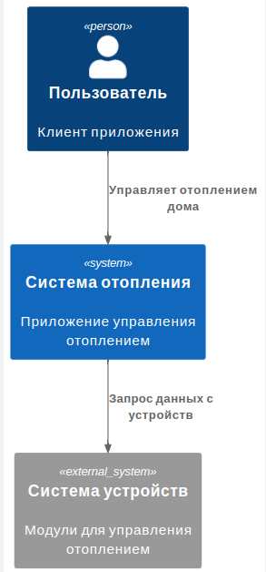

# Sprint 3

## Задание 1: Анализ и проектирование

### Подзадание 1.1: Анализ и планирование

#### Схема управления отоплением:

[C4](schemas/task1-1.puml)

#### Анализ архитектуры монолитного приложения:

1. Язык программирования: Java
2. База данных: PostgreSQL
3. Архитектура: Монолитная, все компоненты системы (обработка запросов, бизнес-логика, работа с данными) находятся в рамках одного приложения.
4. Взаимодействие: Синхронное, запросы обрабатываются последовательно.
5. Масштабируемость: Ограничена, так как монолит сложно масштабировать по частям.
6. Развертывание: Требует остановки всего приложения.

#### Домены:

| Управление отоплением                                     | Мониторинг температуры                                      |
| --------------------------------------------------------- | ----------------------------------------------------------- |
| Пользователи включают и выключают отопление в своих домах | Система отопления получает данные о температуре с датчиков  |
| Пользователи устанавливают температуру                    | Пользователи получают текущую температуру через приложение. |
| Система отопления поддерживает заданную температуру       |                                                             |

### Подзадание 1.2: Архитектура микросервисов

#### Декомпозиция на микросервисы:

| Микросервис  | Описание                                   |
| ------------ | ------------------------------------------ |
| Телеметрия   | Обработка данных датчиков отопления        |
| Устройства   | Выполнение комманд датчиков и их контроль |
| Пользователи | Управление пользователями и домами         |

#### Определение взаимодействия.

1. Запросы пользователей идут в API Gateway.
2. API Gateway маршрутизирует запросы к микросервисам.
3. Микросервисы и устройства общаются через шину.
4. Микросервисы хранят данные в базе данных.

#### Визуализация архитектуры

##### C4 — Уровень контейнеров (Containers)
